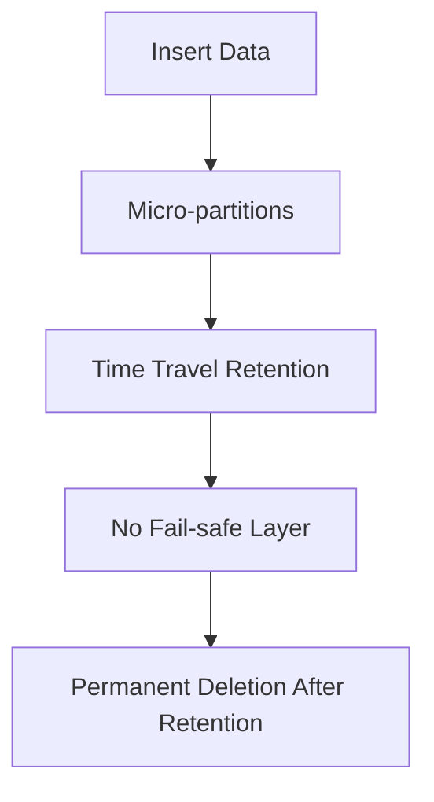
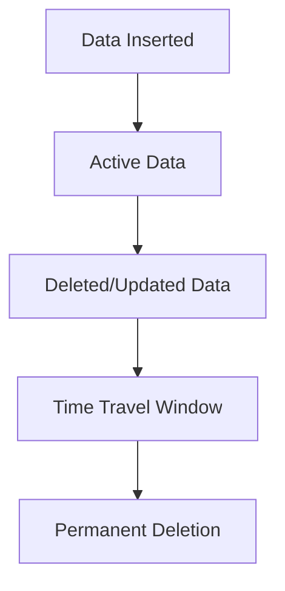
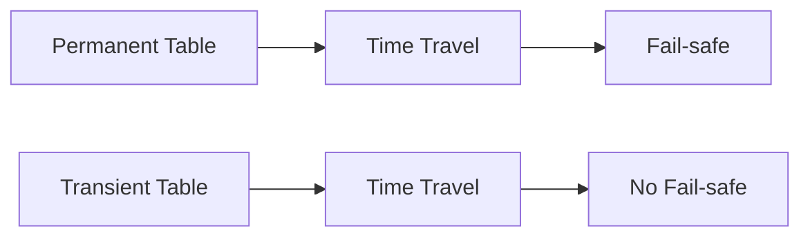
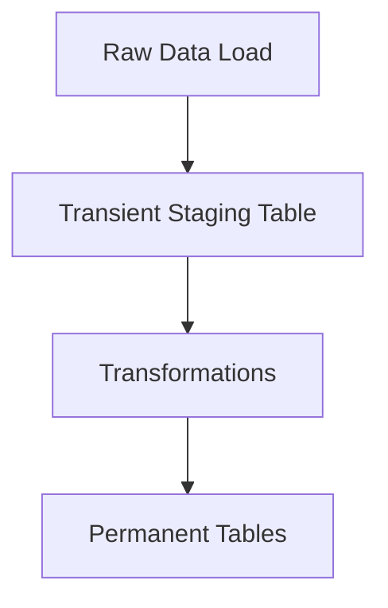

# ❄️ Snowflake Transient Tables — In-Depth Guide

---

# 1. Overview

**Transient tables** in Snowflake are a special type of table designed for:

- Temporary or non-critical data
- Reduced storage cost
- No Fail-safe protection

👉 They are similar to permanent tables but with **limited data recovery features**.

---

# 2. Table Type Comparison Matrix

| Table Type | Time Travel | Fail-safe | Use Case |
|-----------|------------|----------|----------|
| Permanent | Yes | Yes | Critical data |
| Transient | Yes (max 1 day) | ❌ No | Staging, ETL steps (persists after session) |
| Temporary | Session only | ❌ No | Session-specific ETL, non-persistent data |

---

# 3. Key Characteristics of Transient Tables

- No Fail-safe (reduces cost)
- Supports Time Travel (1 day default)
- Persistent across sessions
- Lower storage cost than permanent tables

---

# 4. Storage Behavior



---

# 5. Creating Transient Tables

## 5.1 Basic Syntax

```sql
CREATE TRANSIENT TABLE orders (
    id INT,
    amount NUMBER,
    created_at TIMESTAMP
);
```

---

## 5.2 With Cluster Key

```sql
CREATE TRANSIENT TABLE orders (
    id INT,
    order_date DATE
)
CLUSTER BY (order_date);
```

---

## 5.3 Using CTAS (Create Table As Select)

```sql
CREATE TRANSIENT TABLE orders_transient AS
SELECT * FROM orders;
```

---

# 6. Time Travel in Transient Tables

- Default retention: 1 day
- Can be configured (0–1 days)

```sql
ALTER TABLE orders SET DATA_RETENTION_TIME_IN_DAYS = 1;
```

---

# 7. No Fail-safe — What It Means

Permanent tables:
- 7-day Fail-safe recovery (extra cost)

Transient tables:
- ❌ No Fail-safe
- Data is permanently deleted after Time Travel expires

---

# 8. Data Lifecycle



---

# 9. Use Cases

## ✅ Ideal Scenarios

- **High-Volume Ingestion:** Use Transient tables for initial `COPY INTO` commands. It avoids Fail-safe costs for raw data that can be re-loaded from S3/Azure/GCS if lost.
- **Multi-step ETL:** Use Transient tables for intermediate steps in a pipeline that spans multiple sessions or tasks.
- **Testing:** Creating clones of production data for dev/test environments.
- **Session Data:** Use Temporary tables for data that is strictly local to a single user's logic (e.g., UI session state).

## 🚀 High-Volume Performance Tips
- **Clustering:** Even Transient/Temporary tables benefit from `CLUSTER BY` if you are filtering millions of rows.
- **CTAS:** Use `CREATE TRANSIENT TABLE ... AS SELECT` for the fastest way to move high volumes of data.
- **Drop Manually:** For Transient tables, drop them explicitly after the pipeline finishes to stop storage billing immediately.

---

## ❌ Avoid Using For

- Critical business data
- Compliance-required storage
- Long-term analytics storage
- **Triggers:** Snowflake does not support triggers on any table type. Use **Streams and Tasks** for similar "reactive" logic.

---

# 10. Performance

👉 Same performance as permanent tables

- Uses micro-partitioning
- Supports clustering
- Same query optimization

---

# 11. Cost Benefits

- No Fail-safe storage cost
- Reduced long-term storage charges

---

# 12. Comparison Example



---

# 13. DML Operations

## Insert

```sql
INSERT INTO orders VALUES (1, 100, CURRENT_TIMESTAMP);
```

## Update

```sql
UPDATE orders SET amount = 200 WHERE id = 1;
```

## Delete

```sql
DELETE FROM orders WHERE id = 1;
```

---

---

## 13.1 Triggers (Not Supported)

It's important to note that **Snowflake does not support database triggers** on any table type, including transient tables. If you require logic to execute automatically before or after DML operations, you typically implement this logic within stored procedures, streams and tasks, or external orchestration tools.

---

# 14. Cloning Transient Tables

You can clone transient tables, and the clone will also be a transient table by default. This is useful for creating quick copies for testing or parallel processing.

```sql
CREATE TRANSIENT TABLE orders_clone CLONE orders;
```

---

# 15. Converting Table Type

You cannot directly convert permanent → transient.

Workaround:

```sql
CREATE TRANSIENT TABLE new_table AS
SELECT * FROM old_table;
```

---

# 16. Best Practices

- Use for non-critical workloads
- Combine with clustering for large datasets
- Set minimal retention if recovery not needed
- Use in ETL pipelines
- Combine with clustering for large datasets that are frequently filtered.
- **Leverage in Stored Procedures:** Create and manage transient tables within stored procedures for intermediate processing steps.
- **Monitor Usage:** Regularly review the need for transient tables and drop them when no longer required to optimize storage costs.

---

# 17. Common Mistakes

❌ Assuming Fail-safe exists  
❌ Using for critical production data  
❌ Expecting trigger functionality
❌ Ignoring retention settings  

---

# 18. Real-World Architecture



---

# 19. Interview Answer

A transient table in Snowflake is a table type that persists beyond sessions but does not have Fail-safe protection, making it cost-efficient for temporary or non-critical data storage.

---

# 20. Summary

- Transient tables = cost-efficient storage
- No Fail-safe
- Limited recovery via Time Travel
- Ideal for pipelines and staging

---

**End of Document**
